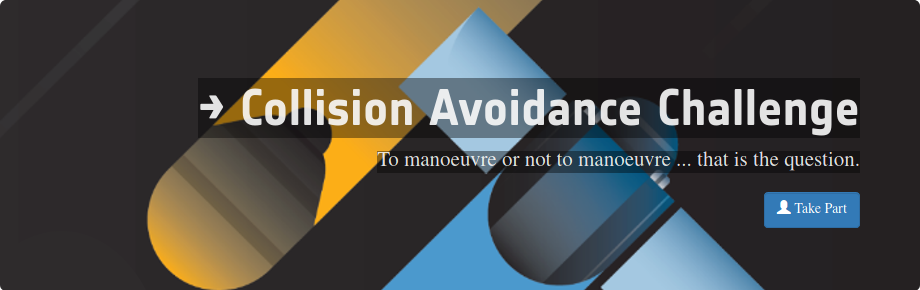

# Collision Avoidance Challenge (2019)
### Deep Learning Approach
#### Comptetition organized by European Space Agency (ESA)
[Link to competition](https://kelvins.esa.int/collision-avoidance-challenge/home/)

Today, active collision avoidance among orbiting satellites has become a routine task in space operations, relying on validated, accurate and timely space surveillance data. For a typical satellite in Low Earth Orbit, hundreds of alerts are issued every week corresponding to possible close encounters between a satellite and another space object (in the form of conjunction data messages CDMs). After automatic processing and filtering, there remain about 2 actionable alerts per spacecraft and week, requiring detailed follow-up by an analyst. On average, at the European Space Agency, more than one collision avoidance manoeuvre is performed per satellite and year.

In this challenge, you are tasked to build a model to predict the final collision risk estimate between a given satellite and a space object (e.g. another satellite, space debris, etc). To do so, you will have access to a database of real-world conjunction data messages (CDMs) carefully prepared at ESA. 

Project developed with [Sergio Pérez][1]

[1]: https://github.com/spmorillo

